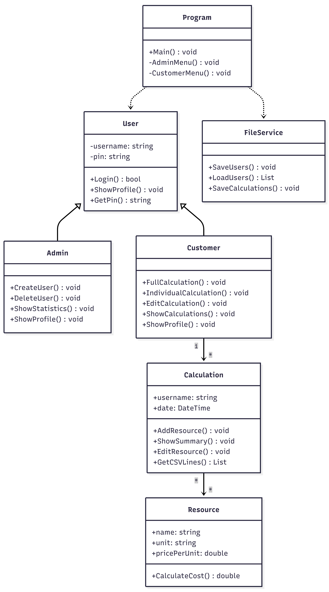
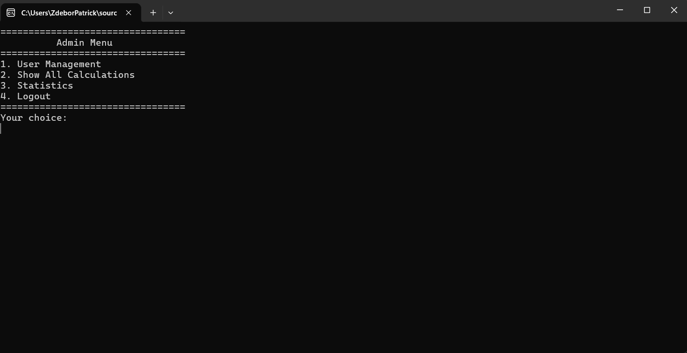
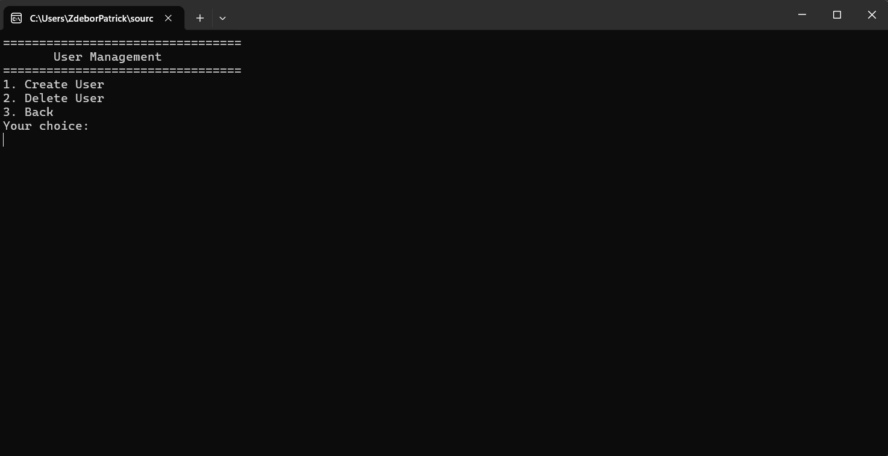
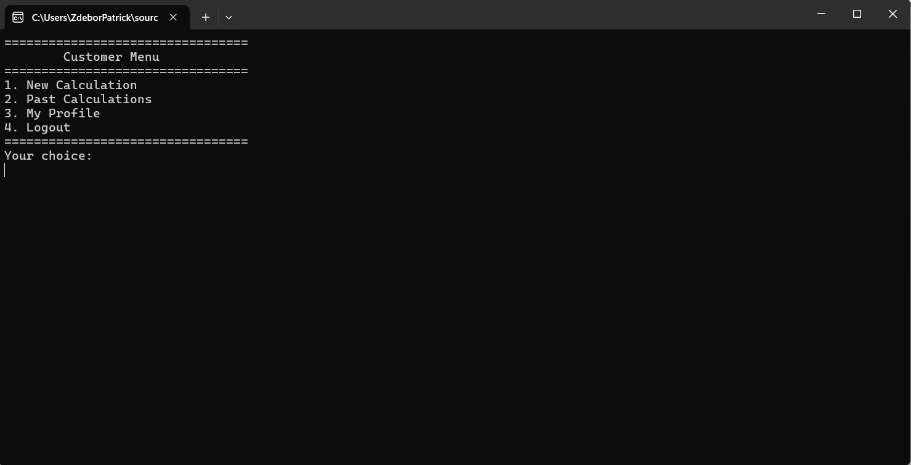
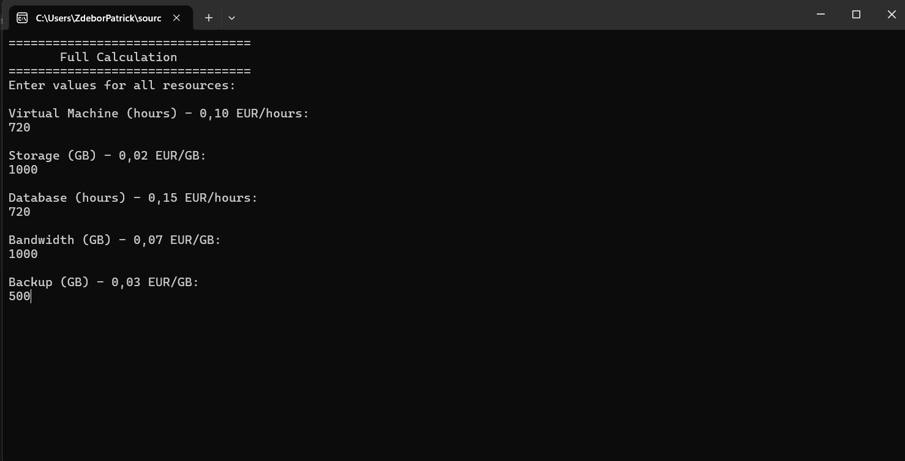

# AzureCostManager


## Description
A C# console application that helps companies manage 
and monitor their monthly Azure cloud costs.

## Features
- Role-based login system (Admin & Customer)
- Cost calculation for Azure resources
- CSV data persistence
- User management (Admin only)
- Historical calculations overview

## Project Structure 
```
AzureCostManager/
├── Classes/
│   ├── Admin.cs
│   ├── Calculation.cs
│   ├── Customer.cs
│   ├── Resource.cs
│   └── User.cs
├── Data/
│   ├── calculations.csv
│   └── users.csv
├── docs/
│   └── class-diagram.png
├── Services/
│   └── FileService.cs
└── Program.cs
```

## Class Diagram


## Screenshots
### Login


### Admin Menu



### Customer Menu



### Calculation



## How to Run
1. Clone the repository
2. Open AzureCostManager.sln in Visual Studio
3. Press F5 to run

## Technologies
- C# / .NET
- Visual Studio Community 2022
- GitHub

## AI Tools Used
| Tool | Purpose |
|------|---------|
| Claude (Anthropic) | Designelements for Project Structure (└──, ├──, │  )
| Claude (Anthropic) | Trouble shooting with github and vs community 
| Claude (Anthropic) | Trouble shooting for CSV persistence

## Development Log

### Day 1
- Repository set up
- Project structure created
- README created

### Day 2
- Class diagram created in Draw.io
- Project classes created (User, Admin, Customer)

### Day 3 
- User.cs, Admin.cs, Customer.cs implemented
- Resource.cs and Calculation.cs created
- Troubleshooting delete .vs from github and commit in VS Community vs. powershell

### Day 4
- Resource.cs and Calculation.cs implemented
- Program.cs implemented
- Extended calculation features added (Full, Custom, Edit)
- FileService.cs implemented
- CSV persistence in progress - debugging ongoing

### Day 5 
- FileService.cs implemented
- CSV persistence for users and calculations added
- Duplicate username validation added
- bug fixes and code cleanup

### Day 6
- Class Diagram completed
- Screenshots added
- README finalized 
- Presentation prepared